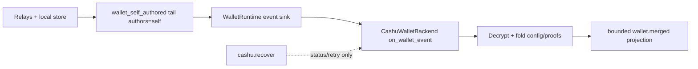

# Cashu Wallet Event-Derived Rehydration

## Summary

Make the account's self-authored wallet event stream the source of truth for Cashu wallet state. The wallet should rehydrate from cache replay plus relay tailing on launch/account activation; cashu.recover is only an explicit status or retry surface, not the correctness path.

## Boundaries

## Detailed Plan

## Context

Issue #3029 was filed against master `0143621`. Current `origin/master` is `bc6b42592`, and local inspection shows several later wallet changes already point in the desired direction:

- `crates/nmp-wallet/src/runtime.rs` constructs `WalletRuntime`, opens identity-reactive observed projections, calls eager cold-start `sync()`, and routes observed events into `WalletBackend::on_wallet_event`.
- `crates/nmp-wallet/src/interests.rs` defines `wallet_self_authored_shape(pubkey)` for self-authored NIP-60/NIP-61 wallet kinds and keeps the kind list out of `nmp-core`.
- `crates/nmp-wallet/src/backend/cashu/events.rs` handles self-authored kind:17375 and kind:7375 via passive ingestion.
- `crates/nmp-wallet/src/backend/cashu/ingest.rs` decrypts and folds wallet config and token events into `CashuWalletState`.
- `crates/nmp-wallet/src/register.rs` registers the merged wallet projection under `wallet.merged`.

The plan is to validate and harden that architecture rather than add a second recovery path.

## Implementation Steps

1. Reproduce the external symptom against current master. Use a focused test or harness with a pre-existing active account, cached/self-authored kind:17375 and kind:7375 events, and a fresh `NmpApp` start. Confirm whether `wallet.merged` emits `cashu_p2pk_pubkey` and balances without dispatching `cashu.recover`.

2. Audit the stream lifecycle. Confirm `wallet_self_authored_shape` is registered before start, eager-synced at registration, re-synced on active-account changes, store-served before live tail, and closed/replaced on account switch. If any of these is missing in production, fix `WalletRuntime`/`ObservedProjectionReconciler` wiring rather than adding host logic.

3. Audit routing. `wallet_self_authored_shape` is an `authors=self` interest. Confirm it reaches the account's write relays or app bootstrap relays on cold start and does not require wallet kinds in `nmp-core::SELF_KINDS_TAILING`. If routing fails for an account with no cached kind:10002, fix the wallet-owned interest scope/flags in `nmp-wallet`, not `nmp-core`.

4. Audit replay completeness. `REPLAY_LIMIT = 512` may be fine for display rows, but money state must not silently omit live proofs. Either prove wallet writers consolidate token events so 512 cannot omit spendable state, or introduce a budgeted internal wallet replay path for all matching cached events while preserving bounded emitted projection rows.

5. Keep `cashu.recover` secondary. Its job is to surface explicit success/failure and optionally trigger reconciliation/check-state against already cached events. It must not be required for launch rehydration.

6. Confirm projection consumption. If the external consumer still reads legacy `wallet` instead of `wallet.merged`, document and/or adjust the builder/runtime surface so Cashu consumers decode the merged projection. Do not solve this by overloading an old NWC-only shape unless that migration is intentional and tested.

7. Add regressions:

- runtime registration opens and reopens the self-authored wallet tail on identity changes;
- cached kind:17375 replay loads `cashu_p2pk_pubkey` without recover;
- cached kind:7375 replay folds balances/proofs without recover;
- superseded/out-of-order token events are confluent;
- account switch clears prior wallet state before new account replay;
- no wallet private key, proof secret, quote id, raw mint response, or plaintext crosses the projection;
- `cashu.create` after a recovered wallet fails closed and never rotates the existing P2PK key.

8. Update durable docs only if implementation behavior or consumer guidance changes. Likely owners: `docs/builder-guide/29-nip60-wallet.md` and, if a new invariant is discovered, `docs/architecture/nip60-nip61-wallet-design.md`.

## Validation

Run focused tests for touched crates, expected minimum:

- `cargo test -p nmp-wallet`
- `cargo test -p nmp-testing --test doctrine_lint_smoke`

If projection schema/codegen changes, also run the FlatBuffers/codegen regeneration gate and projection wire tests. If public symbols or dependencies move, run `cargo build --workspace` per `AGENTS.md`.

## Rollout

No data migration is expected. The fix changes runtime hydration/replay behavior and tests. Existing relays and local stores remain the authority.

## Rollback

Revert the wallet runtime/ingest/projection changes. Because no new host-owned state or migration is introduced, rollback should restore prior behavior without cleanup.

## Risks And Open Questions

- A consumer may be rendering the old NWC-only `wallet` key rather than the merged Cashu-capable projection.
- The current replay cap may be a real correctness cap. This needs proof or replacement before claiming wallet state is always in sync.
- Passive decrypt failures are intentionally silent to avoid replay toasts. Explicit `cashu.recover` should remain the user-visible diagnostic path for signer NIP-44 failures.
- If a relay does not serve historical self-authored wallet events and the local store is empty, NMP can only show degraded/no-wallet state. The framework should not fabricate state or rotate keys in response.

## Rule And ADR Check

- AGENTS.md: Rust owns wallet recovery and relay-derived state; native shells render projections and dispatch typed actions only.
- D3/ADR-0071: relay selection stays automatic and route-provenanced. The wallet stream must use NMP interests and NIP-65/app-relay routing, not host-provided relay lists.
- D4: nmp-wallet is the single writer for wallet facts; no native cache or separate recovery store.
- D5/ADR-0070: emitted WalletProjection rows stay bounded and typed. Internal replay may be more complete than the UI projection, but raw events/proofs never cross FFI.
- D6/D7: signer decrypt failures and recovery status surface as state/action-stage results. Native never decides recoverability.
- D8: replay and tailing are event-driven and budgeted, with no polling or blocking projection closures.
- Crate boundaries: nmp-wallet owns the wallet product composition; nmp-nip60 owns codecs/mechanics; nmp-core must not learn Cashu or NIP-60/NIP-61 kind lists.

## Possible Rule Or ADR Loosening

- No rule or ADR should be loosened. The requested direction is stricter than an imperative recover action and aligns with Rust-owned, event-derived state.
- Do not loosen D5 by exporting raw wallet events or proofs to let a consumer rebuild wallet state.

## Possible Rule Tightening

- Consider adding a wallet-specific builder-guide invariant: recovery actions must not be the sole hydration path for durable protocol state that can be replayed from relays/cache.
- Consider a doctrine or test ratchet that prevents wallet correctness from depending on a projection replay cap unless a compaction/consolidation invariant proves the cap is safe.
- Clarify in the wallet builder guide which projection key external consumers should decode, especially if the merged Cashu projection is under wallet.merged while older NWC status remains under wallet.

## Alternatives Considered

- Implement cashu.recover as the primary loader. Rejected: it makes correctness imperative and easy for consumers to skip.
- Add NIP-60/NIP-61 kinds to nmp-core SELF_KINDS_TAILING. Rejected: it violates the crate-boundary rule that nmp-core stays Cashu-free.
- Let consumers persist or reconstruct wallet state locally. Rejected: creates a second writer and leaks wallet policy into shells.
- Only read the latest kind:17375 and ignore token-event replay. Rejected: it recovers the receive key but not balances or proof inventory.
- Export raw wallet events across FFI and let the host fold them. Rejected: violates bounded typed projections and native-thin-shell doctrine.

## Certainty

86 percent.

## Decision

ready

## Hosted Artifacts

- Plan page: Generated after publishing.

- TTS audio: https://blossom.primal.net/0790ddb391b51d425b36c7d0a16d8bb222cafa4cd3f7f8701f7f10610afff261.mp3
