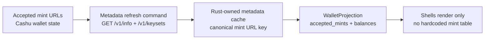

# Issue 3030 Wallet Projection Mint Metadata

## Summary

Enrich the merged wallet projection with a bounded accepted-mints row list and Rust-owned NUT-06 metadata so shells can render first-class mint identity without hardcoded tables or native-side joins.

## Boundaries

## Detailed Plan

## Summary

Issue #3030 asks for two related things: the accepted-mint URL list, and display-safe mint metadata so external consumers such as nutsack do not hardcode mint identity. The clean shape is an additive `WalletProjection` evolution: keep `accepted_mint_count`, add bounded accepted-mint rows, and fill those rows from Rust-owned mint metadata cache state.

## Implementation Plan

1. Add NUT-06 support in `nmp-nip60`.
- Add `cashu::http::info` with `build_get_info_request` for `GET /v1/info`, `parse_info_response`, and typed models for the source-backed fields NMP will expose: `name`, `icon_url`, `nuts` method/unit settings, and optional endpoint fields worth preserving as raw metadata.
- Keep parsing pure and transport-neutral, matching the existing request/response modules. Add `MintHttpOperation::GetInfo` and a native `MintClient::get_info` wrapper under the existing `native` feature.
- Avoid a second NUT-06 parser. If `nmp-nip87` continues parsing embedded NUT-06 content, either route its capability extraction through the new shared helper or make the shared helper live where both crates can use it without a forbidden dependency. The goal is one parser for NUT-06 `nuts` semantics.
- Do not synthesize an `output_fee`. Current protocol-backed fee data available in this code path is keyset `input_fee_ppk` from `/v1/keysets` plus NUT-06 method settings such as supported unit/method and min/max amounts. Expose those explicitly and optionally.

2. Add accepted-mint metadata state in `nmp-wallet`.
- Extend `CashuWalletState` with a bounded `accepted_mint_metadata` map keyed by canonical mint URL. Values should carry `Unknown`, `Refreshing`, `Ready`, or `Failed` state plus the display-safe fields.
- On create, recover, set-mints, and wallet-event ingest, reconcile this map against `state.mints`: retain still-accepted entries, evict removed URLs, insert unknown rows for new URLs, and schedule refresh work for new/stale entries.
- Refresh work must run outside the projection snapshot closure and actor hot path. Use an `ActorCommand::Protocol`/worker pattern consistent with existing mint HTTP commands, and ensure completion causes the next update frame to include the changed projection. No polling loops.
- Store only validated, display-safe metadata. Never store raw response bodies, proofs, quote ids, NIP-44 plaintext, bearer tokens, or secret-adjacent material in the projection path.

3. Evolve `WalletProjection` and typed wire.
- Add `WalletMintRow` with `url`, optional `name`, optional `icon_url`, `units`, optional NUT/method support summary, optional `input_fee_ppk`, and a raw metadata status token. Keep the row compact and capped by `MAX_WALLET_PROJECTION_ROWS`.
- Add `accepted_mints: Vec<WalletMintRow>` to `WalletProjection`. Set `accepted_mint_count` from the bounded accepted URL set for backward compatibility.
- Update `WalletBackendSelector::snapshot` to concatenate accepted-mint rows across backends the same way it handles balances/history, while avoiding duplicate URLs if future backends expose the same mint.
- Append FlatBuffers fields to `crates/nmp-wallet/schema/wallet_projection.fbs`, bump `SCHEMA_VERSION` to 5, regenerate through `ci/regenerate-flatbuffers.sh`, and add encode/decode helpers in `projection_wire/rows.rs` without reusing the deprecated discovered-mints slot.

4. Shell and external-consumer behavior.
- Shells can render per-mint identity directly from `wallet.merged.accepted_mints` and can associate balance rows by URL. They should not fetch `/v1/info`, maintain mint tables, or join against `mint_discovery` to make accepted mints displayable.
- `nmp-mint-discovery` remains useful for finding candidate mints. Selecting one into the wallet still flows through the wallet action surface; once accepted, it appears in `WalletProjection.accepted_mints`.

## Rollout

The schema change is additive. Existing consumers that only read `accepted_mint_count` or `balances[].mint` keep working. New consumers can prefer `accepted_mints`. No durable migration is required because metadata is cacheable and reconstructed from the accepted mint URL list.

## Validation

Run `cargo test -p nmp-nip60` for NUT-06 parser/client tests. Run `cargo test -p nmp-wallet` for snapshot bounds, secret-leak checks, accepted-mint reconciliation, selector merge behavior, and FlatBuffers round trips. If shared parsing touches `nmp-nip87` or `nmp-mint-discovery`, run their crate tests too. Always run `cargo test -p nmp-testing --test doctrine_lint_smoke`. Because this likely changes public symbols and may change crate dependencies or generated FlatBuffers, run `cargo build --workspace` as the compile-only gate.

## Rollback

A rollback can revert the additive projection/schema/cache changes without changing wallet money state. Since accepted-mint metadata is derived from accepted URLs and mint HTTP responses, no persisted data needs migration back. If a metadata refresh bug appears after merge, disable scheduling while leaving existing projection fields empty rather than moving the responsibility to shells.

## Observability

Use log-safe operation labels, mint counts, and canonical public mint URLs only when already public via the wallet's accepted list. Prefer per-row metadata status over user-facing toast noise for transient `/v1/info` failures. Do not log raw response bodies.

## Risks And Open Questions

The biggest risk is over-modeling the NUT-06 response. Keep v1 small: identity, icon, units/method settings, and source-backed fee data only. Another risk is parser drift with `nmp-nip87`; implementation should converge on one NUT-06 capability extraction path. Open question: whether `motd` and `tos_url` belong in the first wallet projection row or should wait for a dedicated mint-detail view, because `motd` can become user-visible policy rather than simple identity metadata.

## Rule And ADR Check

- AGENTS.md and docs/aim.md section 2: Rust owns wallet/domain facts; shells render only. The plan keeps mint identity, accepted-mint membership, and metadata refresh state in `nmp-wallet`/`nmp-nip60`.
- ADR-0072: capability flow is Rust request, raw operation, Rust decision. Mint HTTP metadata fetches are Rust-owned worker/capability work; native shells do not decide retry, cache, or product meaning.
- D4/D5/D8: one writer, bounded projection, no hot-path I/O. `accepted_mints` is capped by existing wallet projection bounds and snapshot emission only reads precomputed cache state.
- `docs/architecture/nip60-nip61-wallet-design.md`: the wallet projection may expose balances by mint and accepted nutzap mints, but must never expose proofs, private keys, quote ids, raw mint responses, or unbounded history.
- `docs/architecture/crate-boundaries.md`: `nmp-wallet` is the wallet composition owner; `nmp-mint-discovery` remains the independent discovered/recommended-mints owner and is not folded back into wallet.

## Possible Rule Or ADR Loosening

- No rule needs loosening.
- The tempting shortcut, letting Swift/Kotlin/TUI fetch `/v1/info` or hardcode a mint registry, would violate ADR-0072 and D4, so the plan rejects it.

## Possible Rule Tightening

- Consider adding a durable projection-enrichment rule: any HTTP-backed projection metadata must define its owner, cache key, invalidation trigger, bounds, and non-hot-path refresh mechanism before implementation.
- Consider adding a wallet projection invariant that count-only fields should have a row list when shells need to render the counted entities.

## Alternatives Considered

- Expose only `accepted_mints: Vec<String>` and leave metadata to shells. Simpler, but it leaves the NUT-06 identity problem unsolved and encourages native-side joins.
- Fold NIP-87 discovered mints back into `WalletProjection`. Rejected because #2880 deliberately unwound discovery into `nmp-mint-discovery`; discovered/recommended mints and accepted wallet mints are different product facts.
- Use `nmp-mint-discovery` audit/discovery rows as the accepted-mint metadata source. Useful when composed, but not sufficient because a wallet can accept a mint that has no NIP-87 announcement or recommendation.
- Fetch `/v1/info` synchronously during `WalletRuntime::snapshot`. Rejected as a D8 violation and a projection-emission performance risk.

## Certainty

86 percent.

## Decision

ready

## Hosted Artifacts

- Plan page: Generated after publishing.

- TTS audio: https://blossom.primal.net/0f855b1b4f7fe4985a63594cc7eaf42252c074e30a590289217235ead697f834.mp3
